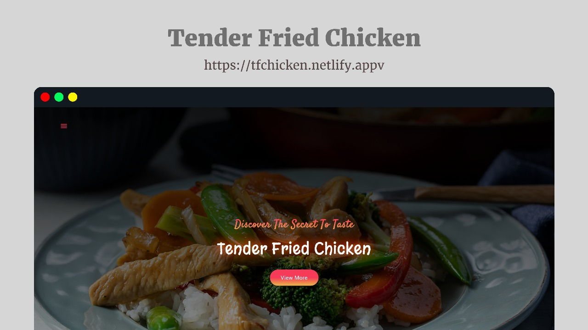

# 🍗 TFC | Tender Fried Chicken 



Welcome to the official website of *Tender Fried Chicken (TFC) Nation* – a stylish, fully responsive restaurant landing page built using HTML and CSS. It showcases the brand’s delicious offerings, vibrant design, and essential features for a modern food website.

🌐 *Live Website:* [https://tfchicken.netlify.app](https://tfchicken.netlify.app)

---

## 📁 Project Structure

TFC-Website/ ├── index.html             # Main HTML page with all sections (nav, hero, about, products, services, contact) ├── style.css              # Styling for layout, animations, and responsiveness ├── img/                   # Folder containing all images │   ├── I-Logo.png │   ├── depositphotos_35261145-.jpg │   ├── 1200-by-1200-images-2.jpg │   ├── Chicken-65-11.jpg │   ├── Chicken-Dum-Biryani-Hyderabadi-Style-V2.jpg │   ├── ChickTikkaKebabs_024_.jpg │   ├── chicken-wings-platter-lectin-free-4-*.jpg │   ├── chicken-hyderabadi-biryani-01-750x750.jpg │   ├── chicken.jpg │   └── vegetable_and_chicken_stir_fry2000x1125.jpg

---

## 🚀 Features  

- 📱 **Responsive Design** – Works seamlessly across desktops, tablets, and mobile devices.  
- 🧭 **Navigation Menu** – Smooth slide-in mobile-friendly navigation.  
- 🎬 **Hero Section** – Eye-catching banner with animated text and CTA button.  
- ⭐ **Features Section** – Highlights brand values (❤️ Love, 🍴 Taste, ⚡ Energy, 👨‍👩‍👧‍👦 Family Recipe).  
- ℹ️ **About Section** – Company story with image hover effects.  
- 🍲 **Products Section** – Interactive product cards with pricing.  
- 🛎️ **Services Section** – Cards with icons, hover animations, and descriptions.  
- 📬 **Contact Section** – Contact form with [FormSubmit](https://formsubmit.co/) integration.  
- ⚡ **Custom Scrollbar** – Styled for modern browsers.  
- 🔗 **Footer** – Social media icons and copyright.  

---

## 🎨 Styling & Fonts

- *CSS Variables* for color and font consistency
- Google Fonts used:
- Roboto
- Inter
- Satisfy
- Margarine
- Modern layout using Flexbox and Media Queries
- Scrollbar and button animations included

---

## 📬 Contact Form

Form submits to:

https://formsubmit.co/prasannawinodh@email.com

You can change the email by editing the form action in index.html.

---

## 🛠️ Tech Stack  

- 🏗️ **HTML5** – Page structure  
- 🎨 **CSS3** – Styling, animations, and layout  
- 🔤 **Google Fonts** – `Roboto`, `Inter`, `Satisfy`, `Margarine`  
- 🖼️ **SVG Icons** – Lightweight vector graphics  

---
## 🚀 How to Use

1. Clone or download the repository.
**Clone the repository**
   ```bash
   git clone https://github.com/WINODH-PRSANNA/TFC-Nation.git
   cd tastee.lk
   ```
2. Open index.html in a browser.
3. Ensure an internet connection for fonts and form handling.

---

## ⚠ License

This project is intended for *educational and portfolio use only*. Commercial use of TFC branding or assets is not permitted.

---

### 👨‍💻 Created by Winodh Prasanna


---
